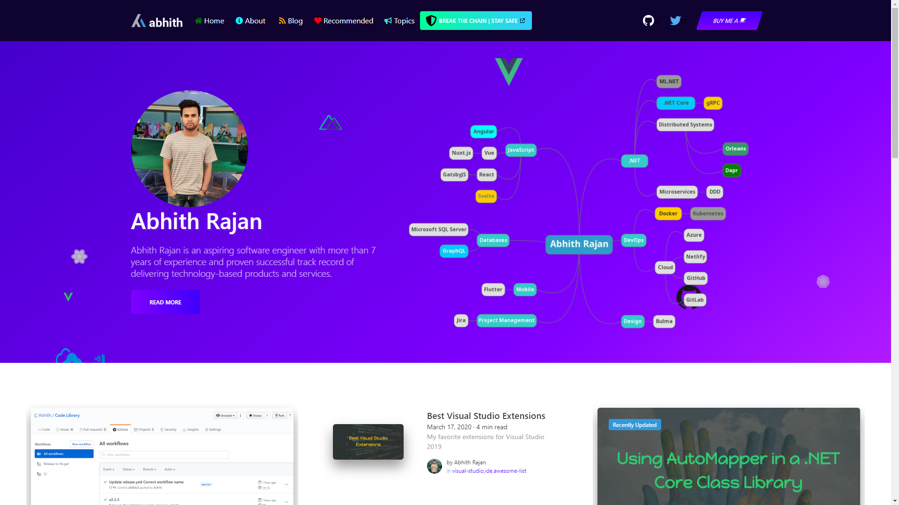

# Edson Frainlar - My thoughts and experience about building enterprise class softwares

This repo serves the source code for [edsonfrainlar.com](https://edsonfrainlar.com/).
It follows the [JAMstack architecture](https://jamstack.org).
Designed using [Bulma](https://bulma.io), and using [Netlify](https://netlify.com/) for continuous deployment.

## Main Sections

Following are the main sections apart from my [blog](https://www.edsonfrainlar.com/blog).

### Developer Stories

I read a lot, and that's how I stay updated about what's going on around.
Here I am listing out some of the stories which I find useful.
Find them [here](https://www.edsonfrainlar.com/recommended/stories/).

### Videos

Here I am listing videos which worth sharing.
Watch them [here](https://www.edsonfrainlar.com/recommended/videos/)

### Tools and Services

Here I am sharing some tools and services which I find useful.

## CONTRIBUTING

You can also suggest me good technical articles, videos and freemium tools and services.
Contributions are always welcome, no matter how large or small.
Before contributing, please read the [code of conduct](CODE_OF_CONDUCT.md).

## INSPIRED FROM
Abhith Rajan

